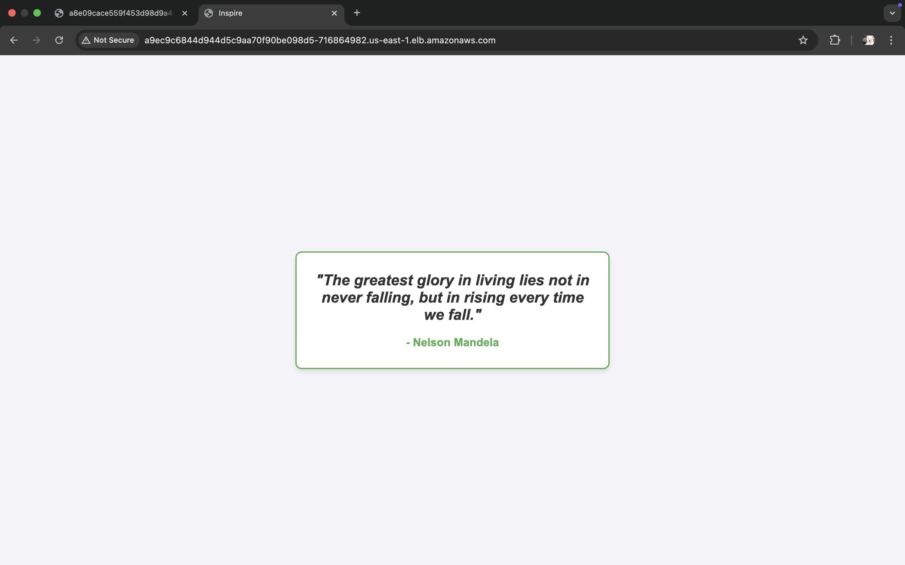
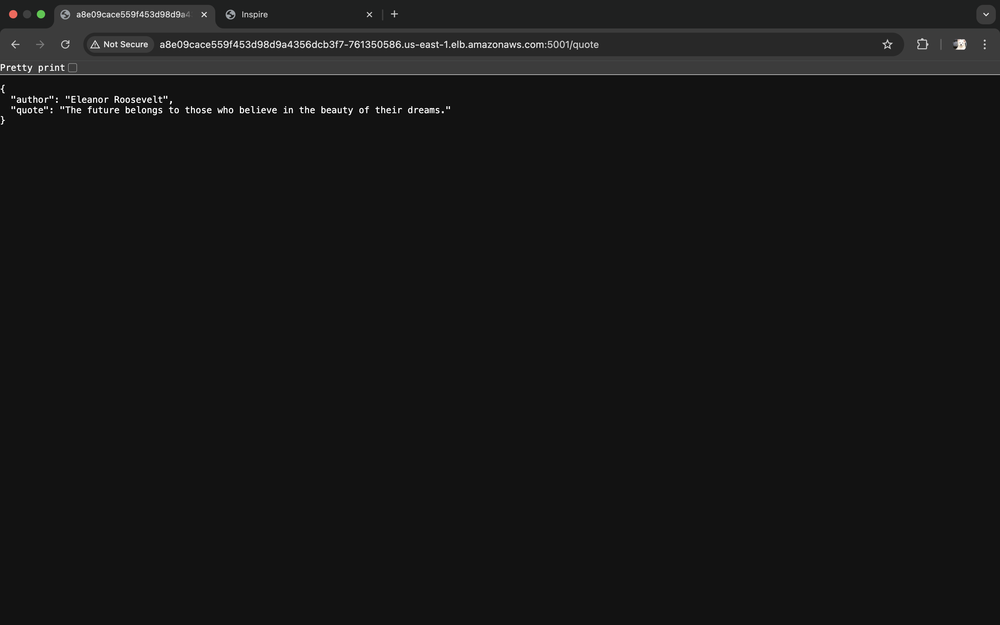
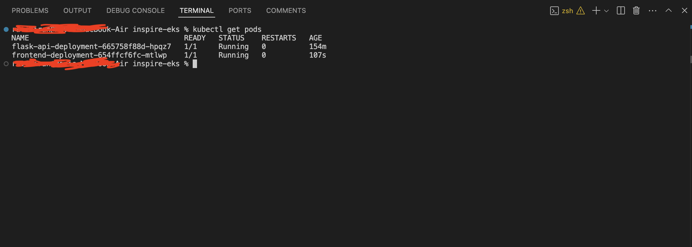

# Inspire Quotes App

The **Inspire** is a cloud-native application designed to display random inspirational quotes. It consists of a backend API built with Flask, a frontend using static HTML, and an infrastructure managed with Terraform. The application is containerized using Docker and deployed to AWS Elastic Kubernetes Service (EKS).

---

## Table of Contents
- [Architecture Diagram](#architecture-diagram)
- [Project Overview](#project-overview)
- [Features](#features)
- [Architecture](#architecture)
- [Tech Stack](#tech-stack)
- [Setup and Deployment](#setup-and-deployment)
- [Screenshots](#screenshots)
- [Repository Structure](#repository-structure)
- [Acknowledgments](#acknowledgments)
- [Future Enhancements](#future-enhancements)

---

## Architecture Diagram


---

## Project Overview

This project showcases the following key cloud-native development skills:
1. **Backend**: A REST API built on flask library to serve random quotes from a JSON file.
2. **Frontend**: A simple webpage to display quotes fetched from the backend API.
3. **Database**: A DynamoDB table storing the quotes.
3. **Infrastructure**: Provisioned using Terraform, including ECR repositories and other AWS resources.
4. **Deployment**: Containers deployed to AWS EKS using Kubernetes manifests.

---

## Features

- Random quote generation via the backend API which is fetched from the DyanamoDB table.
- Frontend dynamically fetches and displays quotes from the API.
- Infrastructure automation with Terraform.
- Deployment and management with Docker and Kubernetes.

---

## Architecture

### Workflow
1. The **frontend** sends requests to the backend API for quotes.
2. The **backend API** reads quotes from a JSON file and serves a random quote.
3. Both services are containerized and managed using Kubernetes.
4. Infrastructure is provisioned with Terraform, including:
   - **ECR Repositories**: For container image storage.
   - **Database**: For storing motivational quotes.
   - **VPC**: A custom VPC with three subnets to deploy the EKS cluster.
   - **EKS**: A managed node group deployed in the EKS cluster.

---

## Tech Stack

- **Languages**: Python (Flask), HTML, CSS, JavaScript
- **Infrastructure as Code (IaC)**: Terraform
- **Containerization**: Docker
- **Orchestration**: Kubernetes (EKS)
- **Cloud Provider**: AWS
- **CI/CD**: GitHub Actions

---

## Setup and Deployment

### Prerequisites
1. **AWS CLI** configured with proper credentials.
2. **Terraform** installed and initialized.
3. **Docker** installed locally.
4. **kubectl** connected to the EKS cluster.

### Steps

#### 1. Provision Infrastructure
- Navigate to the `terraform` directory:
  ```bash
  cd terraform
  ```
- Initialize Terraform:
  ```bash
  terraform init
  ```
- Apply the configuration:
  ```bash
  terraform apply
  ```

#### 2. Build and Push Docker Images
- Backend:
  ```bash
  docker build -t <backend-ecr-repo-url>:latest ./backend
  docker push <backend-ecr-repo-url>:latest
  ```
- Frontend:
  ```bash
  docker build -t <frontend-ecr-repo-url>:latest ./frontend
  docker push <frontend-ecr-repo-url>:latest
  ```

#### 3. Deploy to Kubernetes
- Apply the Kubernetes manifest:
  ```bash
  kubectl apply -f inspire-deployment.yaml
  ```

#### 4. Access the Application
- Use the frontend service's LoadBalancer URL to access the application.
- The backend service's LoadBalancer URL can be used to test API endpoints.

---

## Screenshots

### 1. Application Frontend


### 2. Backend API Response


### 3. Kubernetes Pods


---

## Repository Structure

```
.
├── LICENSE
├── README.md                   # Project documentation
├── backend                     # Backend Flask application
│   ├── Dockerfile
│   ├── app.py
│   └── requirements.txt
├── docker-compose.yml          # Docker Compose configuration
├── frontend                    # Frontend static website
│   ├── Dockerfile
│   └── index.html
├── inspire-deployment.yaml     # Kubernetes deployment and service manifests
├── proofs                      # Screenshots of the running application
│   ├── api.png
│   ├── index_page.png
│   └── kubectl_get_pods.png
├── quotes-data.json            # JSON file containing quotes
├── table-updater.py            # Script for uploading quotes to DynamoDB table
├── terraform                   # Terraform configurations
│   ├── main.tf
│   ├── modules
│   │   ├── database
│   │   │   └── main.tf
│   │   └── ecr
│   │       └── main.tf

```
